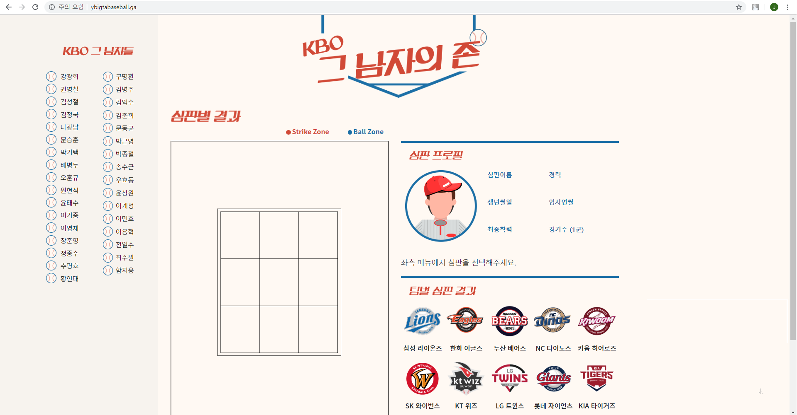
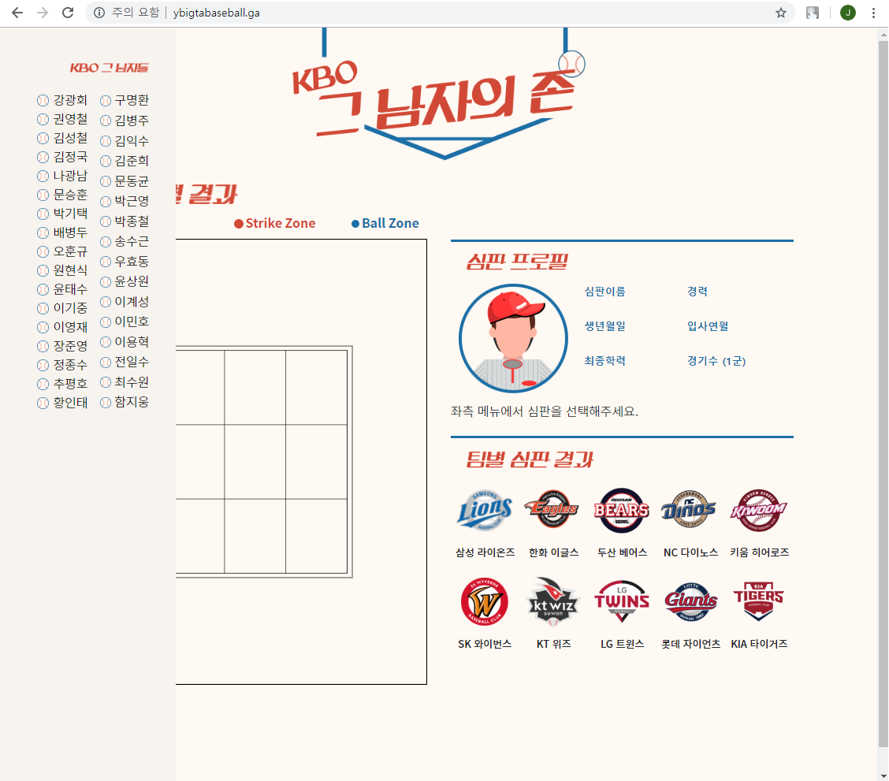
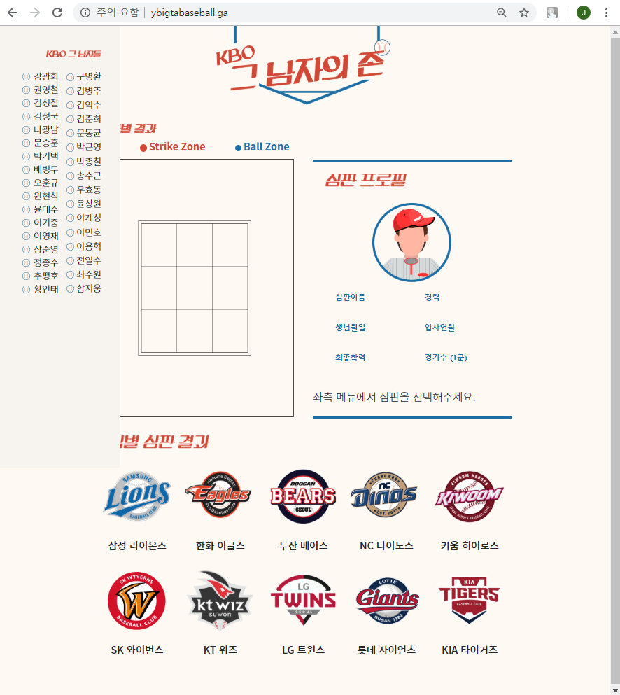
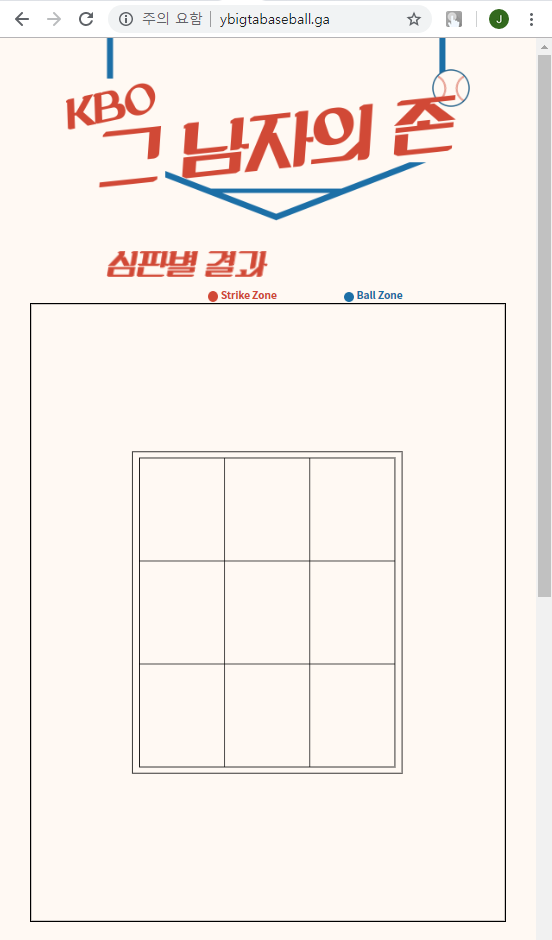
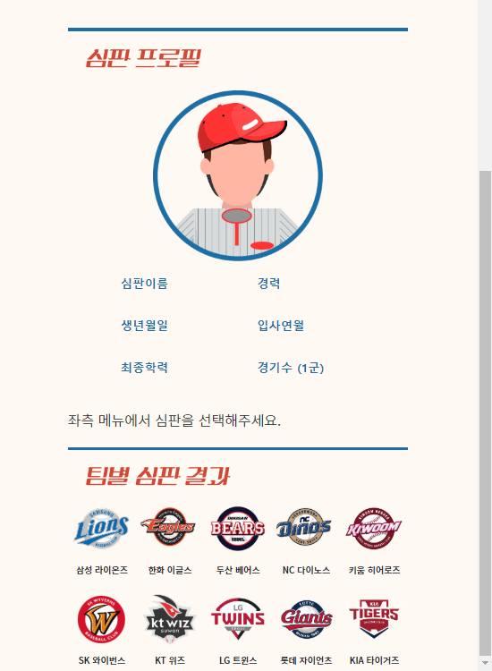
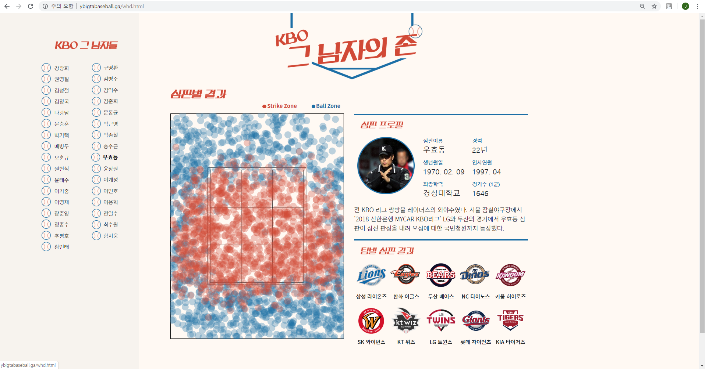
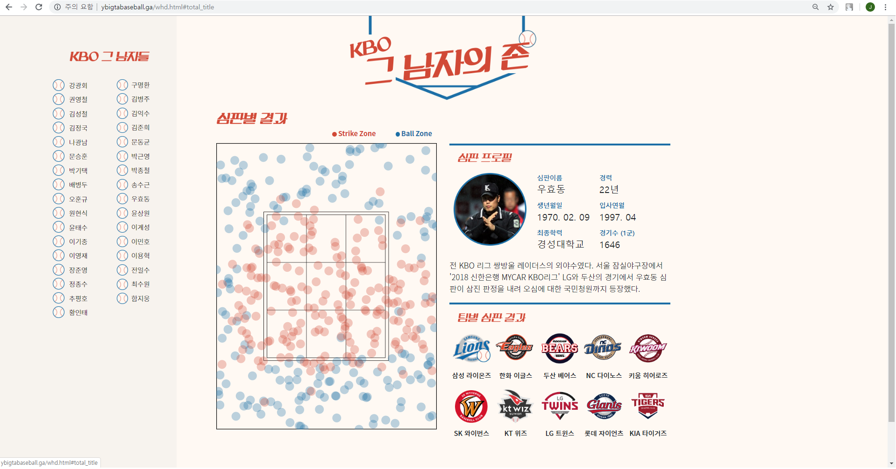
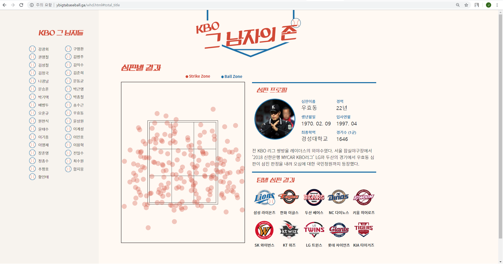

## < KBO, 그 남자의 존 >
: KBO 심판의 스트라이크, 볼 판정에 대한 분석을 통해 심판 그들만의 고유한 <b>스트라이크 존</b>을 알아보고, 웹을 통해 구현.  
URL: http://ybigtabaseball.ga/
 

## Project Detail
### Strike Zone
: 유니폼의 어깨 윗부분과 바지 윗부분 중간의 수평선을 상한선으로하고, 무릎 아랫부분을 하한선으로 하는 홈 플레이트 상공을 말한다.  
<b>스트라이크 존</b>은 투구를 치려는 타자의 스탠스에 따라 결정된다.

### Problem
: 심판의 능력에 전적으로 맡기는 고유영역인 <b>스트라이크 존</b>  
<b>스트라이크 존</b>은 야구에서 <b>가장 논쟁적인 영역이자 온갖 다툼과 항의, 숱한 퇴장의 근원</b>이다.

매 시즌마다 <b>스트라이크 존</b>에 대한 논란은 제기되고 있다.  
야구 규칙은 <b>스트라이크 존</b>을 유니폼의 어깨 윗부분과 바지 윗부분 중간의 수평선을 상한선으로 하고, 무릎 아랫부분을 하한선으로 하는 홈 베이스 상공으로 정의한다.  
이때 공의 일부분이라도 이 <b>스트라이크 존</b>을 통과하면 스트라이크로 판정한다.  
 
<b>과연 KBO의 심판들의 스트라이크 존은 얼마나 정확할까?</b>

 

## WebPage Example
### Different Frames Depending on the Screens

 

  

 

